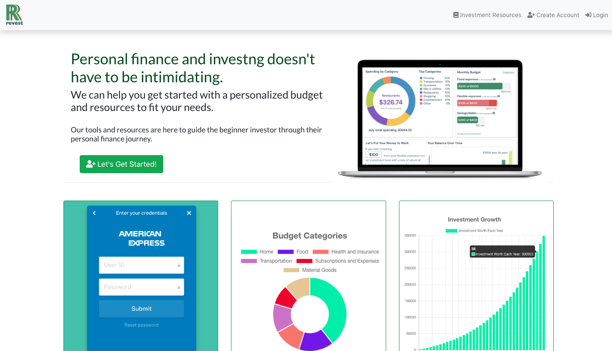
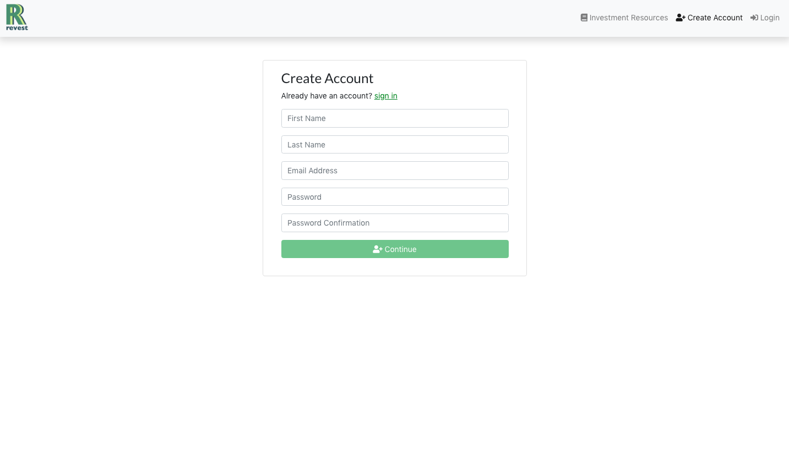
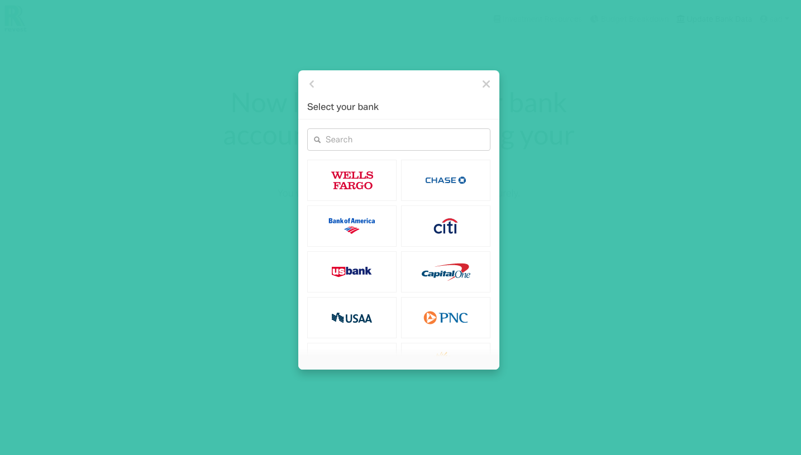
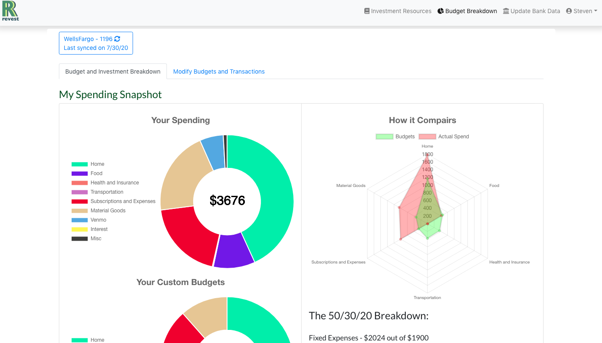
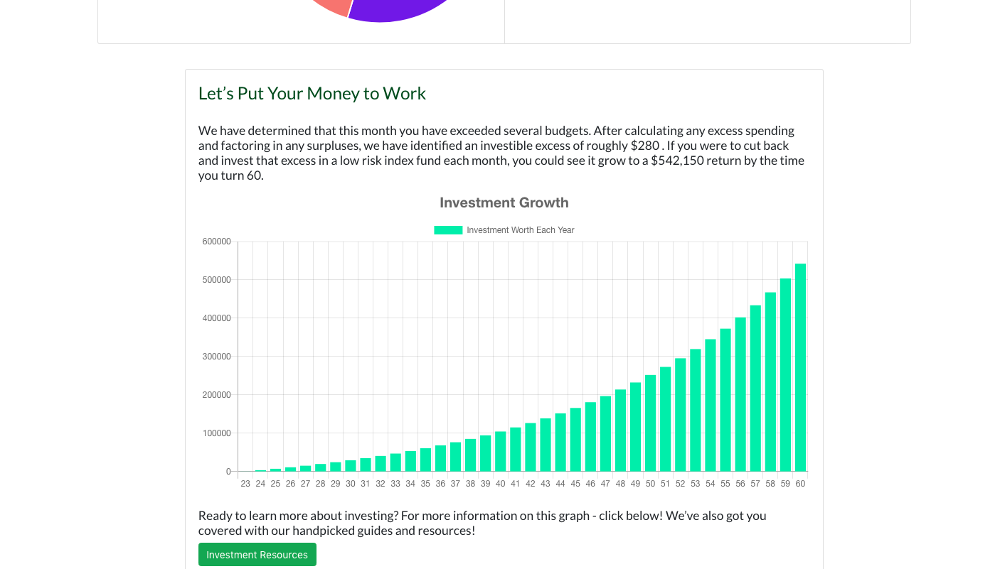
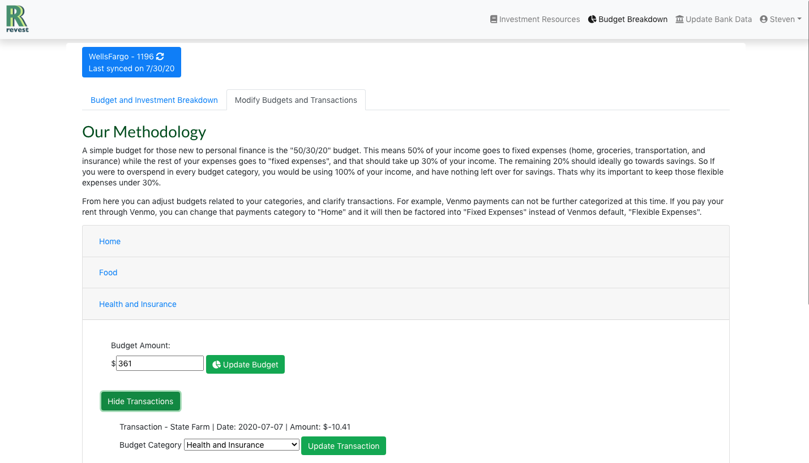

# Revest - Backend

Revest is an application that analyses a users bank data, generates customized bugets, and tracks there spending in order to encourage saving and investing. 

[This](https://github.com/sap2411/revest-frontend) is a link to the front-end repository.

## Motivation

I wanted to create an app that could encourage young professionals to take charge of their finances and consider investing. I had been learning a lot about these topics over the year by seeing other peoples financials used as examples for how to budget properly, and I wanted to give that ability to any user. 

## Screenshots
Home Page



Create Account



Connect Bank Account



Track Your Spending



Realize Potential Investment



Customize Budgets



Learn More On Investing


## Technology Used

- JavaScript
- Ruby on Rails
- React
- Bootstrap
- Plaid

## Features

Users Can:
- Create an account
- Connect their bank account and import transactions
- Track their spending and budgeting
- Customize their budgets
- Work towards an investment goal
- Learn more about investing through linked resources
- Edit their income, age, or delete their account

## Installation

Clone the front-end, and run 
```
$ npm i && npm audit fix 
$ yarn start
```
Clone back-end repo, aquire an api secret key from Plaid and use it on line 10 of revest-backend/app/models/plaid.rb, run the following commands in order: 
```
$ bundle install
$ rails db:migrate 
$ rails db:seed
$ rails s -p 3001
```

## Contributing

Contributions are welcome, submit a pull request!

## Author

* **Steven Parsons** - [GitHub](https://github.com/sap24471)

## License

This project is licensed under the [GNU GPL](https://www.gnu.org/licenses/gpl-3.0.en.html)